# Trade Activate

Trade Activate is a web app for trade marketing activations. Vendors (activation agencies) send brand ambassadors (BAs) to outlets to run activations, sampling and trade activities for our brands. BAs log what is happening from their phones, and the trade marketing team and each vendor's manager watch it live.

**Brands:** Trophy Lager, Trophy Stout, Budweiser, Budweiser Royale, Hero Lager, Beta Malt, Grand Malt, Flying Fish, Eagle, Eagle Extra Stout, Castle Lite.

**Live app:** https://josephokwuchukwu.github.io/TradeMarketing-Activation/

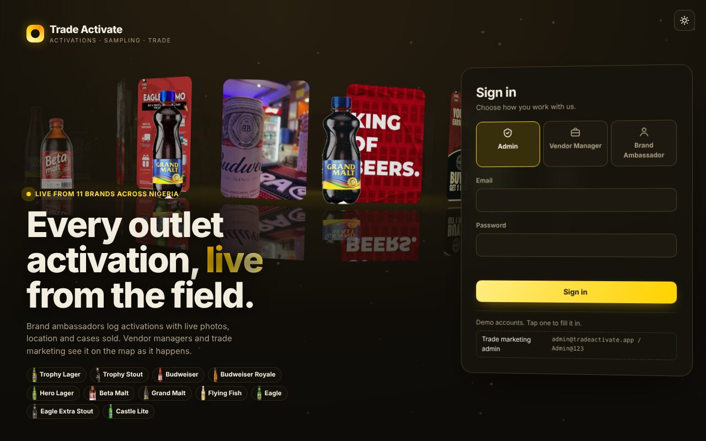

## How it works, start to finish

Trade marketing sets things up once, agencies and their brand ambassadors run activations every day, and everyone sees the results live.

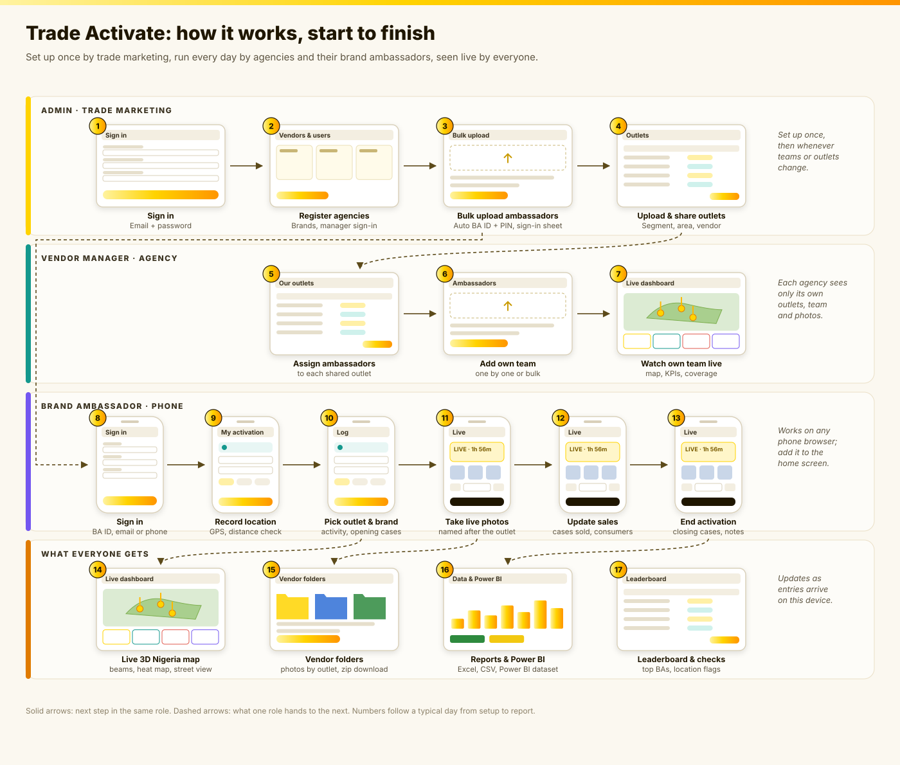

1. **Admin sets up** (steps 1 to 4): register each agency, bulk upload its ambassadors (each gets a BA ID and PIN), and upload the outlet list and share outlets with each agency.
2. **Agency manager organises** (steps 5 to 7): assign ambassadors to the shared outlets, add more ambassadors, and watch their own team on the live dashboard.
3. **Ambassador runs the activation on their phone** (steps 8 to 13): sign in, record location, pick the outlet and brand, take live photos, update cases sold and consumers reached, then end the activation.
4. **Everyone sees the results** (steps 14 to 17): beams on the live 3D map, photos filed by vendor and outlet, reports and the Power BI dataset, and the ambassador leaderboard.

## Screenshots

| Admin live dashboard | Vendor manager dashboard |
| --- | --- |
| 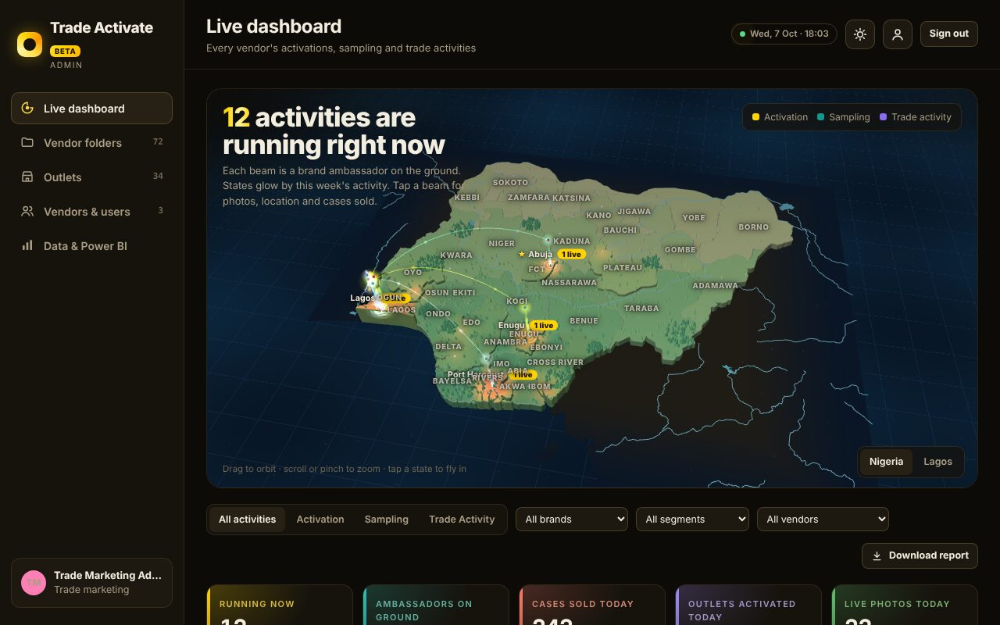 | 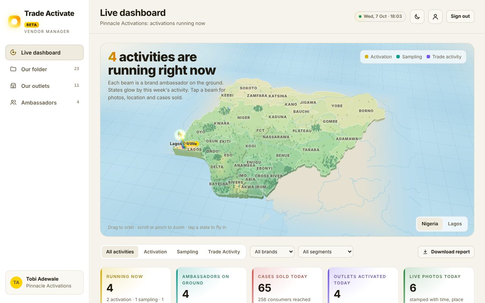 |
| **Vendors & users** | **Bulk upload ambassadors** |
| 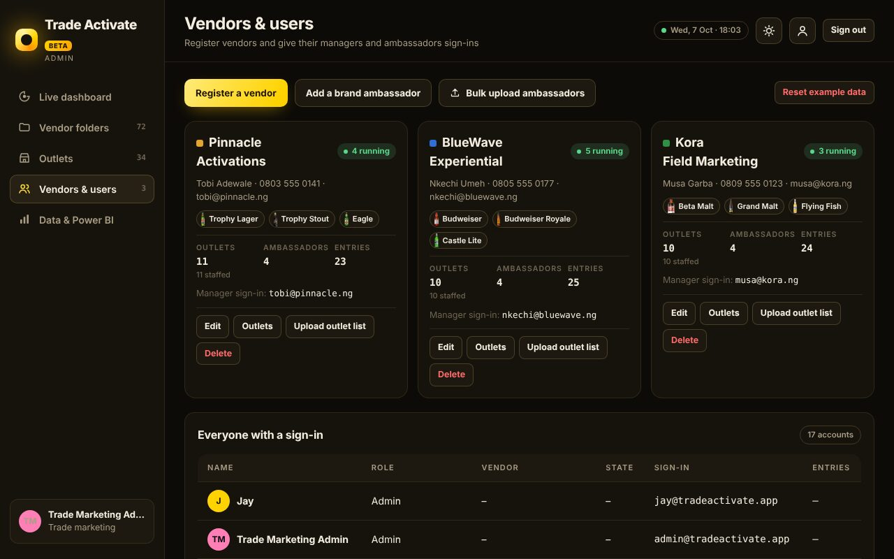 | 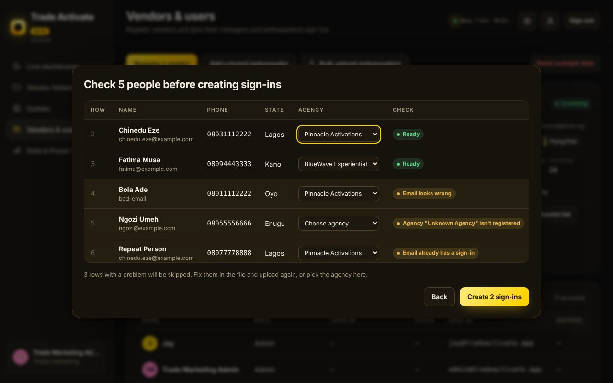 |
| **Vendor folders** | **Agency's outlets and ambassadors** |
| 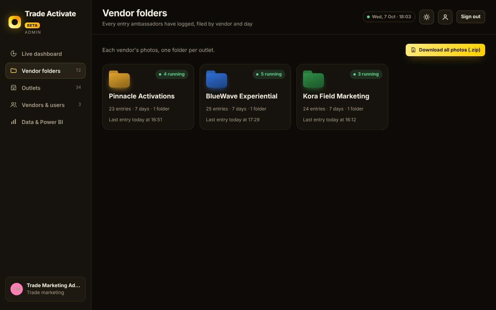 | 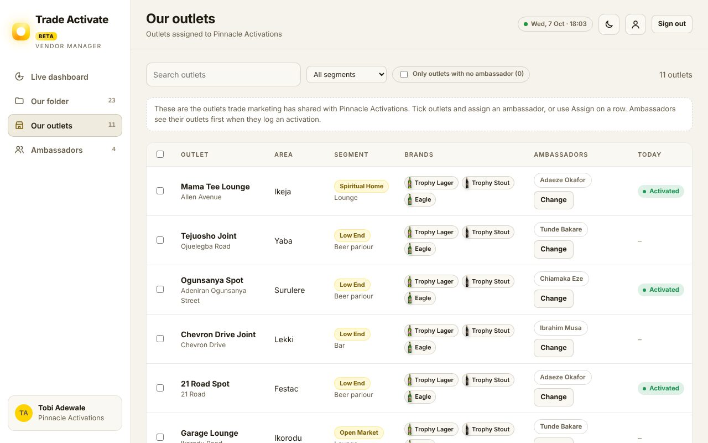 |
| **Data & Power BI** | |
| 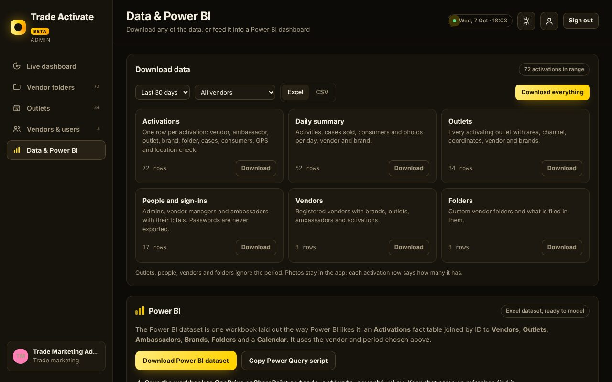 | |

On the ambassador's phone:

<p>
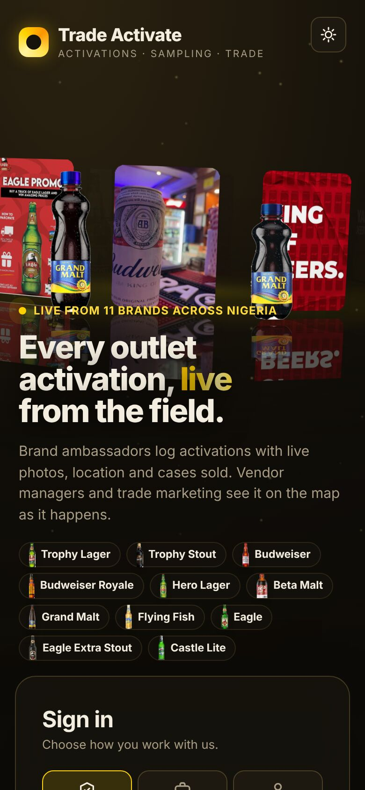
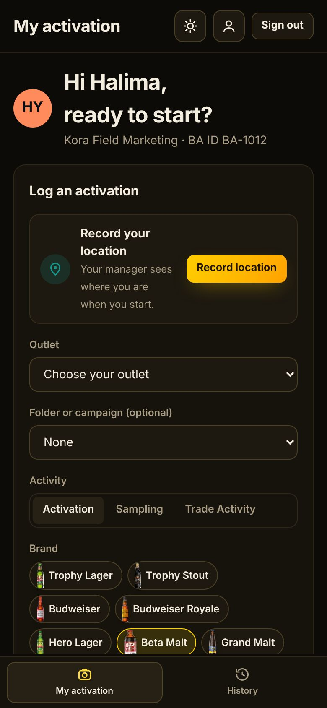
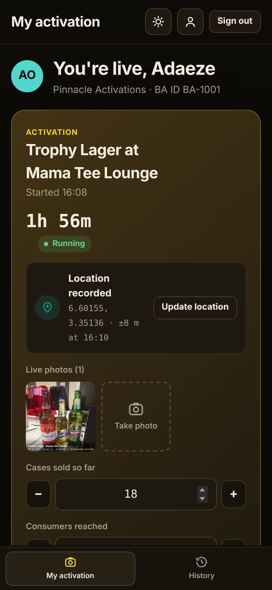
</p>

## Who signs in, and what they see

| Role | Signs in with | Panes |
| --- | --- | --- |
| **Admin** (trade marketing) | Email and password | Live dashboard (all vendors), Vendor folders (every vendor), Outlets (upload and assign), Vendors & users (register, edit and delete vendors, share outlets with them, add managers and BAs) |
| **Vendor Manager** | Email and password | Live dashboard (their vendor only), their vendor folder, the outlets shared with them (and which ambassador covers each), their ambassadors |
| **Supervisor** | Email and password | Team dashboard (their ambassadors only: who is active, who is on location, the areas they cover, on the map), My ambassadors (status, assigned outlets, call or WhatsApp), Team photos |
| **Brand Ambassador** | BA ID, email or phone number, plus a PIN | My activation (their assigned outlets, log form, live card), History |

### Owner account

Jay's own admin sign-in is `jay@tradeactivate.app`. The password was shared with Jay directly and is not in this repository (only its hash is). Change it any time under **My account** (the person icon in the top bar).

### Example accounts (created on first run)

| Role | Sign-in | Password / PIN |
| --- | --- | --- |
| Admin | `admin@tradeactivate.app` | `Admin@123` |
| Vendor Manager, Pinnacle Activations | `tobi@pinnacle.ng` | `Manager@123` |
| Vendor Manager, BlueWave Experiential | `nkechi@bluewave.ng` | `Manager@123` |
| Vendor Manager, Kora Field Marketing | `musa@kora.ng` | `Manager@123` |
| Supervisor, Pinnacle Activations | `kemi@pinnacle.ng` | `Super@123` |
| Supervisor, BlueWave Experiential | `uche@bluewave.ng` | `Super@123` |
| Supervisor, Kora Field Marketing | `aisha@kora.ng` | `Super@123` |
| Brand Ambassadors | `BA-1001` to `BA-1012` | `1234` |

The example vendors, people, outlets and photos are made up. An admin can wipe them under **Vendors & users → Reset example data**.

## Features

- **Look.** A bright yellow theme built on #FFD300, with a flowing yellow-to-orange gradient on buttons, a light sweep across the main buttons, a turning logo ring and shimmering headline words, in light and dark mode. Animations switch off for people who turn on reduced motion on their device.
- **Sign-in page.** A turning 3D ring of real brand and field photos (drag to spin) behind the sign-in card, with high-resolution pack shots of the range (Hero, Budweiser, Castle Lite, Eagle Lager and Extra Stout, Flying Fish, and Beta Malt and Grand Malt in bottle, can and PET) parading around it, turning to face you and growing as they come to the front.
- **Live dashboard.** A 3D map of Nigeria built from real boundaries (37 states, the Niger and Benue, Lake Chad, major cities; Natural Earth, public domain). States are tinted by vegetation belt (mangrove and rainforest in the south through Guinea and Sudan savanna to the Sahel), with forests and the main national parks (Cross River, Okomu, Old Oyo, Kainji Lake, Yankari, Gashaka-Gumti and others) shown as trees, and they rise with the week's activity. Activations from the last 7 days show as a heat map (yellow to deep red, stronger for more cases and for live activations) painted on the land, and every state has a name callout. Zoom into a city or open an entry and **Street view here** opens Google Street View for that spot. Hover a state for its numbers, tap it to fly in, or switch between the Nigeria and Lagos views. There is a beam for every activation, sampling session or trade activity that is running now, coloured by activity type. KPIs show what is running, ambassadors on the ground, cases sold today, outlets activated and live photos. You can filter by activity type, brand and (for admins) vendor. Tapping a beam or row opens the entry: photos, recorded location (with a Google Maps link and distance from the outlet), opening cases, cases sold and closing cases.
- **Vendor folders.** One folder per vendor, holding a folder per day, holding every entry ambassadors logged. You can filter by brand. Vendor managers only see their own folder.
  - **Custom folders.** Admins, and each vendor's manager, can add named folders inside a vendor (a campaign, promo or region), rename or delete them, and file any entry into one from the entry's details. Ambassadors can pick the folder when they log.
- **Brand ambassador log form.**
  - **Your outlets.** A card lists the outlets their agency assigned to them, nearest first once location is recorded, with directions and a **Start here** button. The outlet list only shows those outlets (plus "An outlet not on my list"). If nothing is assigned yet, all the agency's outlets are listed and the BA is told to ask their manager or supervisor.
  - Choose the activity type and brand.
  - Enter opening cases, cases sold and consumers reached.
  - Record GPS location. The form shows the nearest assigned outlet.
  - **Take photo** opens the camera inside the app (back camera, full screen, shutter, flip, several shots in a row). If the phone blocks the in-app camera, it offers the phone's own camera app instead, and **or add from your gallery** is still there. Every photo is resized and stamped with the brand, outlet, time and coordinates. Gallery photos older than 15 minutes are flagged.
  - Start it as **Still running**, then add more photos, update cases sold and **End activation** later. Or submit it as **Already finished**.
- **Colourful live dashboard (admin and vendor manager).** KPI tiles with 7-day sparklines that count up when numbers change, the activity mix right now, cases sold over the last 7 days, cases by segment, a vendors-today scoreboard (admin) or outlet coverage ring (vendor manager), plus filters by activity, brand, segment and vendor.
- **Segments.** Every outlet has a trade segment: Mainstream, Low End, High End, Key Account, Open Market, Spiritual Home, Out of Home, plus four recommended additions: Modern Trade (supermarkets, malls), HoReCa (hotels, restaurants, cafés), Events & Festivals, and Wholesale (distributors). Set it in the upload's `Segment` column or on the Outlets page; a first guess is made from the channel and area. Activations carry the outlet's segment into reports and Power BI.
- **Photo folders and zip download.** Every live photo is named after its outlet and time (`Mama Tee Lounge 2026-10-07 14.32.05.jpg`). Vendor folders have a By outlet section with each outlet's photos. **Download photos (.zip)** saves the current vendor, folder, day or outlet, and the admin's **Download all photos** saves everything; unzipped, it is one folder per vendor and outlet, with a `photo-index.csv`.
- **Outlets.** Upload an Excel (`.xlsx`) or CSV list of activating outlets, preview it, assign outlets to vendors (one by one, in bulk, or from a `Vendor` column), and import. Outlets without coordinates are placed by their area name (Ikeja, Lekki, Surulere and others). See `sample-data/outlets-sample.csv` for the columns.
- **Vendors & users.** Register a vendor, pick its brands, and create its manager's sign-in. Each vendor card has **Edit** (name, manager, phone, sign-in email, brands, password reset), **Outlets** (tick which outlets the vendor activates), **Upload outlet list** (import a file straight to that vendor) and **Delete**. Deleting a vendor switches off its sign-ins, ends its running activations and returns its outlets to Not assigned; its past entries stay in reports under its name. Add brand ambassadors with a BA ID and PIN. Vendor managers can add their own ambassadors.
- **Bulk upload ambassadors (admin and vendor manager).** Upload an Excel or CSV file with the columns **Full name, Email, Phone number, State, Agency name** (download the template from the upload window, or see `sample-data/users-sample.csv`). A preview flags bad emails, phone numbers that aren't 11 digits, people who already have a sign-in, and agency names that don't match a registered vendor (the admin can pick the vendor in the preview). Each person gets a BA ID and a random 4-digit PIN straight away, and can sign in with the BA ID, email or phone. Download the sign-in sheet at the end: PINs are stored scrambled, so that is the only time they are shown. When a vendor manager uploads, everyone goes to their own agency.
- **Ambassadors per outlet (vendor manager).** On Our outlets, a manager assigns one or more of their ambassadors to each shared outlet, one row at a time or by ticking several outlets. A filter shows outlets that have no ambassador yet. The admin's Outlets page and the outlets download show who covers each outlet.
- **Supervisors.** Each agency can have supervisors who track their own ambassadors. The vendor manager (or admin) adds a supervisor with **Add a supervisor**, ticks the ambassadors they look after, and can change any ambassador's supervisor from the Supervisor column on the Ambassadors page. The supervisor's Team dashboard shows ambassadors assigned, active now, on location (within 500 m of the outlet), away or with no location, outlets covered today, coverage areas, and a live list of each ambassador, with the map showing their outlets and live beams.
- **Admin notifications and email alerts.** The admin's **Notifications** page has a live feed of every activation started or ended, today's activating agencies (with ambassador count and areas), and totals for agencies, ambassadors out, outlets and states covered. **Email today's summary** sends or drafts the summary email. Real-time emails go out from the ambassador's phone the moment an activation starts or ends (agency, ambassador, supervisor, outlet, coverage area, location check, map link), queued if there's no signal. To switch them on, fill in the `ALERTS` settings near the top of the script in `src/app.html` with an [EmailJS](https://www.emailjs.com/) service ID, template ID and public key (template fields `{{to_email}}`, `{{subject}}`, `{{message}}`), or a webhook URL from Power Automate, Zapier or Make. Alerts go to `jay@tradeactivate.app` by default.
- **Beta features.**
  - **Top ambassadors today.** A leaderboard on the dashboard ranks BAs by cases sold, with consumers reached.
  - **Location check.** Running activations are flagged when the phone shared no location, or was more than 500 m from the outlet's listed position. Flags show on the dashboard and in the report.
  - **Download report.** One click exports an Excel file (Activations sheet and a vendor-by-brand Summary sheet) for today, the last 7 or 30 days, or everything, using the dashboard filters.
  - **My account.** Everyone can change their own password, and BAs their PIN.
  - **Install on phone.** The hosted page can be added to a phone's home screen and keeps opening on a weak network (manifest and service worker; hosted page only).
- **Data & Power BI (admin).** Download activations, a daily summary, outlets, people, vendors and folders as Excel or CSV, for any period and vendor, one at a time or all together. The Power BI dataset is a workbook with an Activations fact table joined by ID to Vendors, Outlets, Ambassadors, Brands, Folders and a Calendar. The pane gives the steps to connect it from OneDrive or SharePoint with scheduled refresh, and a Power Query script. A live Power BI connection with no downloads needs the shared backend described below; Power BI then reads it through its PostgreSQL connector.
- **Real brand images.** Product shots of each brand (cut from Jay's pictures) appear on the sign-in screen, in the brand pickers, on the dashboard bars and in entry details. Example entries use real field photos of the brands. The files are in `assets/`.
- **Light and dark mode.** Use the sun or moon button on the sign-in screen and in the top bar. The choice is remembered on each device. Before you pick, the app follows the device setting.

## Running it

It is a single static page with no build tooling. It needs no server.

```sh
./build.sh                 # writes index.html from src/app.html
python3 -m http.server     # then open http://localhost:8000
```

It is hosted with **GitHub Pages** for this repository (Settings → Pages → deploy from the `main` branch, root folder), so every merge to `main` updates the live link. Ambassadors open it on their phones. GPS and the camera need HTTPS, which Pages provides.

`src/app.html` is the source. `index.html` is generated from it by `build.sh` (it adds the `<!doctype>` and `<head>`). Edit the source, run the build, and commit both.

Three.js (3D) and SheetJS (Excel import) load from cdnjs.

## Important: where data is stored today

All data (accounts, outlets, entries, photos) is stored **in the browser of the device using the app** (IndexedDB). That makes it a working prototype, not yet a shared system:

- An ambassador's entries on their phone **won't** appear on the admin's laptop.
- Two tabs in the same browser do stay in sync live. Try a BA in one tab and the admin in another.
- Passwords are hashed in the browser. This isn't real security.

### Next step: a shared backend

To make it multi-user, replace the `DB` and `save()` layer in `src/app.html` with a hosted backend. The data model is already split the way a database needs it:

| Collection | Holds |
| --- | --- |
| `vendors` | Name, contact, brands, colour |
| `users` | Role (`admin`, `manager`, `ba`), sign-in, email, phone, state, `vendorId` |
| `outlets` | Name, address, area, channel, lat/lng, `vendorId`, brands, `baIds` (assigned ambassadors) |
| `entries` | BA, vendor, outlet, brand, type, start/end, opening/sold cases, consumers reached, GPS, photo ids, notes |
| `photos` | Stamped JPEG, time, GPS |

A good fit is **Supabase** (Postgres, auth with email/password and phone OTP, file storage for photos, and row-level security so vendor managers only read their own vendor's rows). **Firebase** works the same way.

## Project layout

```
src/app.html                    the app (HTML, CSS and JS in one file)
index.html                      built page for hosting (generated by build.sh)
build.sh                        builds index.html (adds the head, manifest link and service worker)
manifest.webmanifest, sw.js     make the hosted page installable and usable on a weak network
icons/                          app icon (SVG source and PNGs)
assets/brands/                  small product shot per brand (brand pickers, dashboard)
assets/products/                high-resolution pack shots (.webp) for the sign-in showcase
docs/screenshots/               screenshots used in this README
docs/app-flow.svg               start-to-finish wireframe of the app
assets/field/                   brand photos used for the example entries
assets/login/                   photos on the 3D sign-in ring
assets/nigeria.json             Nigeria map data: states, rivers, lakes, cities (Natural Earth)
sample-data/outlets-sample.csv  example outlet upload
sample-data/users-sample.csv    example ambassador bulk upload
```
